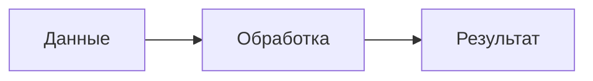

# Справочник Markdown md2gost

Нормативные правила: [синтаксический манифест](syntax-manifest.md).
Этот справочник описывает единственный поддерживаемый синтаксис. Номера,
шрифты, интервалы и оформление выбираются через YAML-конфиг с пресетом.

## Обычный Markdown

Абзацы отделяются пустой строкой. Поддерживаются **жирный**, *курсив*,
~~зачёркивание~~, `строчный код`, [ссылки](https://example.org), изображения,
списки и заголовки. Подчёркивание: `[важное]{.underline}`.

```markdown
# Введение {.unnumbered}

# Методика {#method}

## Подготовка

**[Важное условие]{.underline}**: сохранить исходные данные.

1. Подготовить данные.
   1. Проверить формат.
   2. Удалить дубликаты.
2. Провести измерения.

- Первый набор.
- Второй набор.
```

Заголовок `.unnumbered` не получает видимого номера. Отступы определяют
вложенность списков; `1)` сохраняет скобочный разделитель. Чтобы начать другой
список, отделите его абзацем либо HTML-комментарием. Одна пустая строка список
не перезапускает. Буквенный стиль задаётся атрибутом после обычного списка:

```markdown
1. Первый набор.
2. Второй набор.
{marker="lower-alpha-ru"}
```

## Изображения

```markdown
{#setup}
{width=80%}
{width=6cm height=auto}
```

Подпись — в квадратных скобках. Без размеров изображение масштабируется
автоматически. Если задан один размер, второй сохраняет пропорции. Поддерживаются
`%`, `cm`, `mm`, `pt`, `px`, `in`, `auto`. Файлы читаются через подключённое хранилище (по умолчанию — локальная ФС).

## Таблицы

```markdown
| Набор | Размер | Время, мс |
|:------|:------:|----------:|
| Случайный | 1000 | 1,82 |
| Прямой | 1000 | 1,31 |

: Результаты измерений {#results widths="40%, 30%, 30%" heights="auto, 1cm, auto"}
```

Подпись ставится **после** объекта. В выходном документе её позицию определяет
тип объекта и пресет. `widths` задаёт ширины столбцов, `heights` — минимальные
высоты строк, включая шапку. Допустимы смешанные размеры `"6cm, auto, auto"`.
Без размеров используется autofit. Число значений должно совпадать с таблицей;
процентные высоты строк запрещены. Перенос и продолжение таблицы автоматические.

## Листинги и диаграммы

````markdown
```python
def square(value):
    return value * value
```

: Возведение в квадрат {#square}



: Схема процесса {#process}
````

Код без подписи остаётся ненумерованным листингом. Язык включает подсветку,
если она разрешена конфигом. Для таблиц, листингов и диаграмм используется
одна форма подписи. Mermaid распознаётся парсером; графический рендер пока
остаётся ограничением сервиса и показывает диагностическую заглушку.

## Формулы и ссылки

```markdown
Сложность равна $O(n \log n)$.

$$
\bar{t} = \frac{1}{m}\sum_{i=1}^{m}t_i
$$
{#mean}

См. [](#mean), [](#results) и [описание метода](#method).
```

`[](#id)` подставляет тип и номер объекта. Обычная `[подпись](#id)` сохраняет
авторский текст. Ссылка может предшествовать объекту. ID задаётся явно и должен
быть уникален. Ссылки на отсутствующие или ненумеруемые объекты не разрешаются.

## Источники

````markdown
Метод описан в [@ivanov2020]. Повторная ссылка: [@ivanov2020].

# Список использованных источников {.unnumbered}

::: {.bibliography}
- id: ivanov2020
  type: book
  authors: [Иванов И.И.]
  title: Основы проектирования
  city: М.
  publisher: Наука
  year: 2020
- id: site
  type: web
  text: "Документация проекта. URL: https://example.org"
:::
````

`id` обязателен. `text` печатается как готовое описание; иначе оно собирается
из полей источника. По умолчанию порядок — первое цитирование, включаются
процитированные записи; если цитат нет, выводятся все. Настройка:
`bibliography.order: input` для порядка ввода.

## Шаблоны

```markdown
::: {.template name="titlepage-mirea"}
title: Отчёт по практической работе № 3
subject: Алгоритмы и структуры данных
topic: Исследование сортировки
institute: Институт информационных технологий
department: Инструментального и прикладного программного обеспечения
authors_title: Выполнили
authors:
  - label: Студенты группы ДЕМО-01-25
    names: [Алексеев А.А., Петрова М.С.]
reviewer_title: Проверил
reviewers:
  - label: Старший преподаватель
    names: [Григорьев Г.Г.]
city: МОСКВА
year: 2026 г.
:::

::: {.template name="content" title="СОДЕРЖАНИЕ" depth=3 dot_leader=true}
:::
```

Имя и параметры проверяются реестром шаблонов. Простые параметры можно задать
атрибутами, сложные — YAML-телом. Один параметр нельзя повторять в обоих местах.
Чтобы убрать заголовок содержания, задайте `title=""`. О разработке шаблонов:
[templates-guide.md](templates-guide.md).

## Приложения и страницы

```markdown
# Исходные данные {.appendix #data}

## Описание набора

Текст приложения. Его объекты получают локальные номера с буквой приложения.

# Дополнительные проверки {.appendix}

## Проверка граничного случая

Текст второго приложения.

# Итоги

Снова основная часть документа.

::: {.page-break}
:::
```

Приложение заканчивается следующим заголовком первого уровня. `##` внутри —
первый локальный уровень. Разрыв страницы задаётся отдельным пустым контейнером.
Обычный `---` — горизонтальная линия. Контейнер `.group` объединяет Markdown-блоки
без изменения оформления; при вложенности внешняя ограда длиннее внутренней.

## Буквальная запись

Внутри кода расширения не действуют. В обычном тексте экранируйте начало
служебной записи: `\: подпись`, `\{#id}`, `\[@source]`.
Старые `%table`, `---content`, `@cite:key`, `++текст++`, `# *Заголовок`
и плоские маркеры `1.1.` больше не управляют оформлением.
