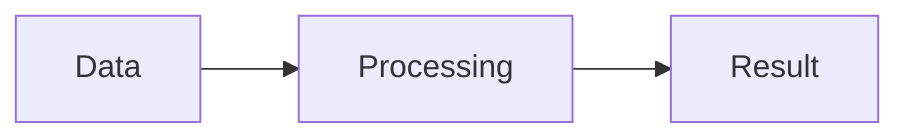

# Syntax

This file is the normative syntax contract and the executable example
corpus in one. The unit suite parses every fenced `markdown` block below
(`tests/unit/parser/test_full_corpus.py`), so documented constructs are
proven to parse — a construct without a live example here is not covered.

Status: this is the only supported syntax. Numbering, fonts, spacing and
layout are chosen by the YAML config with presets — no GOST rule is part
of the grammar.

## Principles

1. Content is written in plain Markdown. Meanings of its constructs are
   never redefined for layout: `---` is a thematic break, `*…*` is
   emphasis, list nesting comes from indentation. A blank line does not
   restart a list.
2. The base is CommonMark with GFM tables and strikethrough. On top of it
   we add TeX math, attributes, captions, object references and
   containers.
3. An existing Markdown element is refined with attributes. A container
   exists for generated insertions or block groups — not for every image
   or table.
4. The author writes meaning, the system produces numbers and layout.
5. One need — one notation. New capabilities extend the shared mechanisms
   instead of adding a new prefix per case.
6. Unknown or inapplicable attributes, duplicate IDs, broken containers
   and unresolvable auto-references are errors, never silent content loss.
7. Source code, inline code and escaped text are never interpreted as
   extensions. Images are FS/storage references, not embedded data.

## Attributes

Form: `{#id .role key=value key2="value with spaces"}`. IDs and role
names start with a letter or `_`, then letters, digits, `_`, `-`. An ID is
unique across the document; bibliography keys have a separate namespace.
A repeated ID, role or key in one block is an error.

Attributes on a heading line apply to the heading; right after an image —
to the image. A standalone attribute line directly after a block applies
to that block and cannot skip over another content block. For literal
text escape the opening brace: `\{…}`.

| Element | Attributes |
|---|---|
| Heading | `#id`, `.unnumbered`, `.appendix` |
| Image | `#id`, `width`, `height` |
| Table | `#id`, `widths`, `heights` |
| Listing, Mermaid, block equation | `#id` |
| Ordered list | `#id`, `marker` |
| Paragraph, bullet list | `#id` |

`marker`: `arabic`, `lower-alpha-ru`, `upper-alpha-ru`, `lower-alpha-en`,
`upper-alpha-en`. Items themselves are always written as plain `1.` or
`1)`.

Image sizes: a positive number with `%`, `cm`, `mm`, `pt`, `px`, `in`, or
`auto`. One dimension preserves the aspect ratio; two explicit dimensions
may change it. `widths` — comma-separated values per column, `heights` —
per row including the header. Row heights are minimums; percentage row
heights are rejected.

Underline is a span: `[text]{.underline}`, with ordinary inline markup
and code allowed inside. Bold, italic and strikethrough stay `**…**`,
`*…*`, `~~…~~`.

## Headings and lists

```markdown
# Introduction {.unnumbered}

# Method {#method}

## Preparation

**[Important condition]{.underline}: keep the source data intact.

1. Prepare the data.
   1. Validate the format.
   2. Remove duplicates.
2. Run the measurements.

- First dataset.
- Second dataset.
```

```markdown
1. First series.
2. Second series.
{marker="lower-alpha-ru"}
```

`.unnumbered` removes the visible number. Indentation defines list
nesting; `1)` keeps the parenthesised delimiter. A different list is
started by a paragraph or an HTML comment between them. Letter style is
set with the `marker` attribute after a regular list.

## Images

```markdown
{#setup}
{width=80%}
{width=6cm height=auto}
```

The caption goes in the square brackets. Without sizes the image scales
automatically; one size preserves proportions. Files are read through the
configured storage (filesystem by default).

## Tables

```markdown
| Dataset | Size | Time, ms |
|:------|:------:|----------:|
| Random | 1000 | 1.82 |
| Sequential | 1000 | 1.31 |

: Measurement results {#results widths="40%, 30%, 30%" heights="auto, 1cm, auto"}
```

The caption stands **after** the object; its position in the output is
decided by the object type and the preset. `widths` sets column widths,
`heights` sets minimum row heights including the header; mixed values like
`"6cm, auto, auto"` are allowed. Without sizes the table uses autofit.
The number of values must match the table. Row spans and continuation are
automatic.

## Listings and diagrams

````markdown
```python
def square(value):
    return value * value
```

: Squaring {#square}



: Process diagram {#process}
````

Code without a caption remains an unnumbered listing. The language enables
highlighting when allowed by the config. Tables, listings and diagrams
share the single caption form. Mermaid is recognised by the parser;
whether it renders graphically depends on the integrating service.

## Math and references

```markdown
Complexity is $O(n \log n)$.

$$
\bar{t} = \frac{1}{m}\sum_{i=1}^{m}t_i
$$
{#mean}

See [](#mean), [](#results) and [the method description](#method).
```

`[](#id)` substitutes the object type and number. A regular
`[label](#id)` keeps the author's text. A reference may precede its
object. IDs are explicit and unique; references to missing or
unnumberable objects do not resolve.

## Bibliography

````markdown
The method is described in [@ivanov2020]. Repeated citation: [@ivanov2020].

# List of sources {.unnumbered}

::: {.bibliography}
- id: ivanov2020
  type: book
  authors: [Ivanov I.I.]
  title: Fundamentals of design
  city: Moscow
  publisher: Nauka
  year: 2020
- id: site
  type: web
  text: "Project documentation. URL: https://example.org"
:::
````

An entry requires `id`; `type` is optional. `text` is printed as the ready
description, otherwise it is assembled from `authors`, `title`, `city`,
`publisher`, `year`, `url`. By default entries are ordered by first
citation and only cited ones are printed; with no citations all entries
are printed. `bibliography.order: input` switches to input order.

## Templates

```markdown
::: {.template name="titlepage-mirea"}
title: Practice report no. 3
subject: Algorithms and data structures
topic: Sorting research
institute: Institute of Information Technology
department: Applied Software Engineering
authors_title: Authors
authors:
  - label: Students of group DEMO-01-25
    names: [Alekseev A.A., Petrova M.S.]
reviewer_title: Reviewed by
reviewers:
  - label: Senior lecturer
    names: [Grigoriev G.G.]
city: MOSCOW
year: 2026
:::

::: {.template name="content" title="TABLE OF CONTENTS" depth=3 dot_leader=true}
:::
```

Template names and parameter schemas come from the template registry.
Simple parameters go into the attributes (`true`/`false` and numbers are
typed, the rest are strings); complex data goes into the YAML body. A
parameter must not appear in both. Set `title=""` to drop the heading of
the generated table of contents.

## Appendices and page breaks

```markdown
# Source data {.appendix #data}

## Dataset description

Appendix text. Its objects get local numbers with the appendix letter.

# Additional checks {.appendix}

## Boundary case

Text of the second appendix.

# Summary

Back to the main numbering.

::: {.page-break}
:::
```

An appendix runs until the next level-1 heading; `##` inside it is the
first local level. Letters and local numbers are produced automatically.
`.appendix` is only valid on `#` and incompatible with `.unnumbered`. A
page break is an empty `.page-break` container; a plain `---` is a
thematic break.

## Containers

Opening: `::: {.role …}`. Closing: a separate `:::` line of the same
length. For nesting, the outer fence is longer than the inner one. An
unclosed container is an error.

| Role | Purpose and body |
|---|---|
| `.template name="…"` | Registered template; body is a YAML mapping |
| `.bibliography` | Source list; body is a YAML sequence |
| `.page-break` | Forced page break; empty body |
| `.group` | Group of ordinary Markdown blocks, no layout change |

## Errors

Orphan captions, attribute lines detached from their block, invalid size
values, unknown roles, duplicate IDs, unclosed containers, `.appendix` on
non-level-1 headings, template parameters duplicated across attributes
and body — all raise explicit errors at parse time.

## Literal text and legacy syntax

Inside code, extensions never apply. In running text escape the start of
a service notation: `\: caption`, `\{#id}`, `\[@source]`.

The legacy syntax is gone, with no compatibility switch: `%table`,
`%listing`, `%diagram`, `%appendix`, `---content`, `---titlepage-…`,
`@type:name`, `++…++`, flat `1.1.` markers and letter `а)` markers are
plain Markdown text now, and `# *…` no longer disables numbering. A
fenced `bibliography` block is an ordinary listing. Rewrite old
documents; the DOCX/PDF import emits the new syntax directly.

## Changing this contract

Update this file and the acceptance tests first, then the parser,
validation, import and affected outputs. Unit tests, lint and typecheck
are mandatory, plus whatever integration checks the change touches.
Rendering changes pass the screenshot gate; a failure requires manual
review — regenerating baselines to hide a diff is forbidden.
