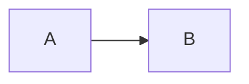

# Syntax reference

markdown-gost extends CommonMark with constructs needed for GOST-style
academic documents. Everything below works in both output formats (DOCX and
HTML preview) unless noted.

A full live sample covering every feature lives in
[example.md](example.md) (Russian, as a typical document would be).

## Inline formatting

| Syntax | Result |
|---|---|
| `**bold**` | **bold** |
| `*italic*` | *italic* |
| `~~strikethrough~~` | strikethrough |
| `++underline++` | underline (GOST documents favor underline over bold) |
| `` `code` `` | monospaced inline code |

Constructs nest, e.g. `**++bold underlined++**`.

Links: `[text](https://example.com)`.

## Headings

`#` … `######` produce numbered section headings (`1`, `1.1`, `1.1.1`, …)
with automatic numbering, configured by preset.

Prefix the text with `*` to opt out of numbering:

```md
# *СПИСОК ИСПОЛЬЗОВАННЫХ ИСТОЧНИКОВ
```

## Tables

GOST tables are created with the `%table` directive followed by a caption
and a standard Markdown table:

```md
%table Продукты

| Наименование | Цена | Количество |
|--------------|------|------------|
| Яблоко       | $1   | 10         |
```

Columns and rows are auto-fitted by default. Explicit sizes go in braces
after the caption:

```md
%table Продукты {widths="6cm, auto, auto"}
%table Продукты {widths="40%, 30%, 30%" heights="auto, 1cm, 1cm"}
```

- `widths` — one value per column: `%` (of the text block), `cm`, `mm`,
  `pt`, `in`, `auto`. A single non-`auto` value switches the table to fixed
  layout; remaining `auto` columns share the leftover space equally.
- `heights` — one value per row **including the header**: `cm`, `mm`, `pt`,
  `in`, `auto` (`%` is not allowed). Explicit values are minimums; rows
  still grow to fit content.
- A count mismatch between values and columns/rows is a validation error.

## Images

```md

{width=80%}
{width=10cm height=auto}
```

Sizes accept `%`, `cm`, `mm`, `pt`, `px`, `in`, `auto`; a single dimension
preserves aspect ratio. Images are referenced by filesystem path or storage
(S3) URL — never inlined into request payloads.

## Listings

`%listing` turns a fenced code block into a numbered, captioned listing
(syntax highlighting is rendered in the HTML preview, monospaced in DOCX):

```md
%listing Merge sort

```python
def merge_sort(arr):
    ...
```
```

## Equations

LaTeX math via `latex2mathml` (DOCX gets native OMML equations):

```md
Inline Euler identity: $e^{i\pi} + 1 = 0$

$$
\sum_{n=1}^{10} n^2
$$
```

## Diagrams

`%diagram` + a `mermaid` fenced block renders a flowchart as an image:

```md
%diagram Диаграмма процессов


```

## Ordered lists

Standard nesting works, and renders with hierarchical numbers (`1.`,
`1.1.`, `1.1.1.`). A flat explicit form is also accepted — literal numbers
are discarded, numbering is always computed:

```md
1. Уровень один
1.1. Уровень два
1.1.1. Уровень три
```

The marker delimiter (`.` or `)`) is preserved from the source: `1)` gives
parenthesized numbering. A list restarting at `1.` after a blank line is a
new list.

Bullet lists use plain `-` items with standard nesting.

## Bibliography

Cite a source inline as `@cite:<id>` — it renders as `[N]`, with repeat
citations keeping the same number. The source list is a fenced
`bibliography` block containing a YAML array; the list heading is your own
Markdown heading:

````md
Text with a citation @cite:ivanov2020.

# *СПИСОК ИСПОЛЬЗОВАННЫХ ИСТОЧНИКОВ

```bibliography
- id: ivanov2020
  type: book
  authors:
    - Иванов И.И.
  title: Основы проектирования
  city: М.
  publisher: Наука
  year: 2020
- id: site
  type: web
  text: "Документация проекта. URL: https://example.test"
```
````

`id` is required. If `text` is present it is printed verbatim after the
number; otherwise the minimal style assembles the entry from `authors`,
`title`, `city`, `publisher`, `year`, `url`. By default the list contains
only cited sources, ordered by first citation; `bibliography.order: input`
in the config switches to source order / all entries.

Internal cross-references `@table:<name>` / `@image:<name>` resolve to the
numbered caption of the matching object.

## Appendices

`%appendix` starts an appendix; everything until the next `%appendix`
belongs to it:

```md
%appendix Исходные данные

# Описание набора данных
```

Each appendix starts on a new page with a centered `ПРИЛОЖЕНИЕ А`,
`ПРИЛОЖЕНИЕ Б`, … (the letters Ё, З, Й, О, Ч, Ъ, Ы, Ь are skipped per
GOST). Objects inside get letter-scoped numbering: `А.1`, `Рисунок А.1`,
`Таблица А.1`, `(А.1)`.

## Templates

A template injects a prebuilt, parameterized fragment — a table of
contents, a title page, etc.:

```md
---content
```

```md
---titlepage-mirea
title: Отчет по практической работе №3
subject: Моделирование сред и разработка приложений
institute: Институт Информационных технологий
authors:
  - label: Студент группы ДЕМО-01-25
    names:
      - Алексеев А.А.
city: МОСКВА
year: 2026 г.
---
```

Available templates and their parameter schemas are listed by the CLI/JSON
API at build time (`markdown_gost.templates.list_templates()`). The built-in
`titlepage-mirea` is a standard Russian university title page with optional
`university_full` / `university_short` fields.

## Page break

A standalone `---` inserts a page break at that point.

## Structural sections

GOST structural sections (СОДЕРЖАНИЕ, ВВЕДЕНИЕ, ЗАКЛЮЧЕНИЕ, СПИСОК
ИСПОЛЬЗОВАННЫХ ИСТОЧНИКОВ) are regular un-numbered headings (the `# *`
form); their labels and placement come from the config preset.
