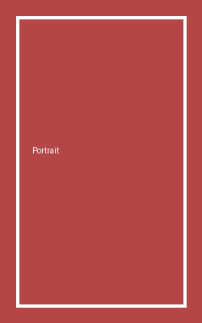

Картинка ровно на половину ширины колонки:

{width=50%}

Картинка с фиксированной шириной 10 см и автоматической высотой:

{width=10cm height=auto}

Портретная картинка с фиксированной высотой:

{height=6cm}
